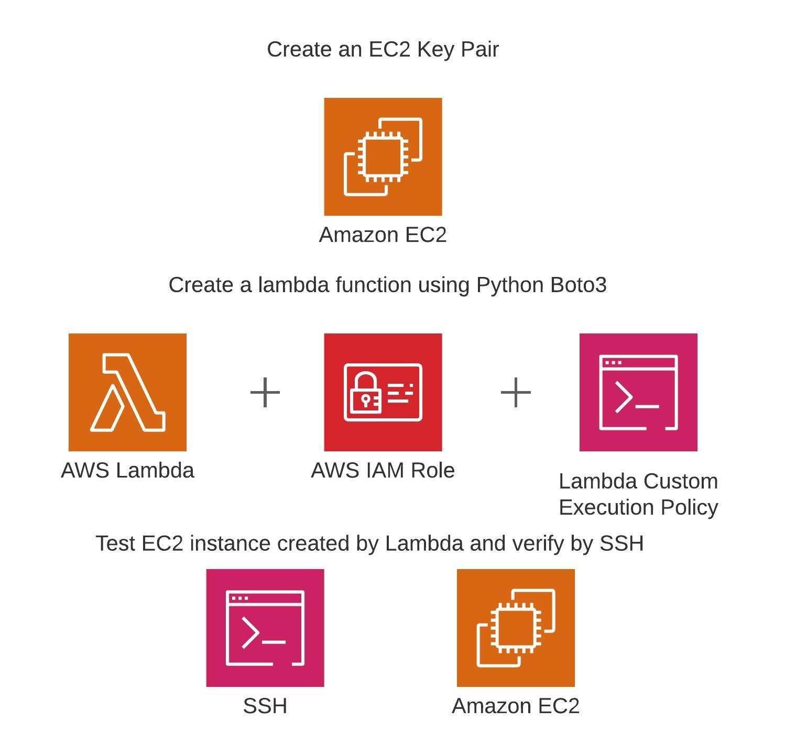

Write a Lambda function that will create an EC2 instance. This Lambda function will be written in Python using the Boto3 library. Also create a custom Lambda execution policy for our IAM role. Then log into the new EC2 instance via SSH.

Here is an inline {:height="5px" width="5px"}.

